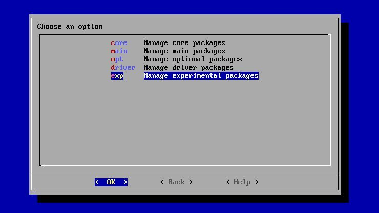

## Readme first
Before installing Steam Link in RetroPie, make sure it's updated to the most recent version with the latest packages available. 

### Step 1

Then, from EmulationStation's main window, choose the RetroPie option and head to RetroPie Setup. Select Update and let it run through the script.

### Step 2

Once that's done, return to the RetroPie Setup screen. Scroll down to Manage Packages, and choose Experimental Packages. Then continue scrolling until you find "steamlink," and hit the install button.

### Step 3

Restart your PI, once completed, you should find it in the Ports section of EmulationStation's main menu, ready to stream games.